# Anime-Imprimatura *漫塗* 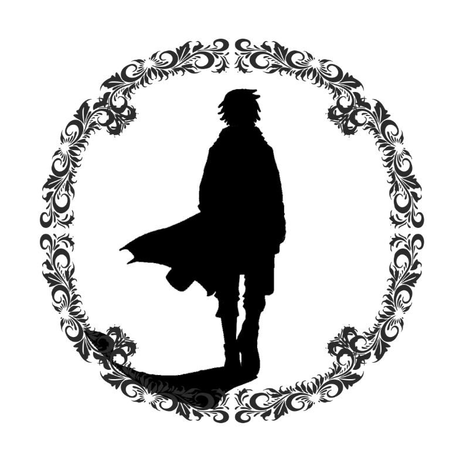

# Anime-Imprimatura
Welcome to the project! For other languages, see:
- [中文版說明文件](README_zh.md)
### Demo Website (http://202.5.253.153/)
### Promotional Video (https://youtu.be/OfGPD1aC1yY)
### Introduction Video (Chinese: https://youtu.be/tt2whU94dNM)
### Introduction Video (English: https://www.youtube.com/watch?v=w2TM-NOkEMM)

## Table of Contents
- [Project Introduction](#project-introduction)
- [System Architecture](#system-architecture)
- [System Functional Divisions](#system-functional-divisions)
- [System Deployment](#system-deployment)
- [Future Research Extensions](#development-and-research-extensions)
- [Branch Details](#branch-descriptions)
- [Contributions](#contributions)

## Project Introduction
- ### Features
    Anime Imprimatura assists 2D animation artists with character base coloring. By uploading a small number of character design images (CHD) and character sketches (CHS), users can generate base-colored character sketches (CHSF), significantly improving efficiency.
    - CHD: Character Design
    - CHS: Character Sketch
    - CHSF: Character Sketch Finished

    (These terms were defined specifically for this project for better communication.)
<p>[Test images](TESTimages/)</p>
<table>
  <thead>
    <tr>
      <th align="center">CHD, Character Design</th>
      <th colspan="3" align="center">CHS, Character Sketch</th>
      <th colspan="3" align="center">CHSF, Character Sketch Finished</th>
    </tr>
  </thead>
  <tbody>
    <tr>
      <td align="center" style="text-align: center; vertical-align: top;">
        
        <p>CHD</p>
      </td>
      <td colspan="3" align="center" style="text-align: center; vertical-align: top;">
        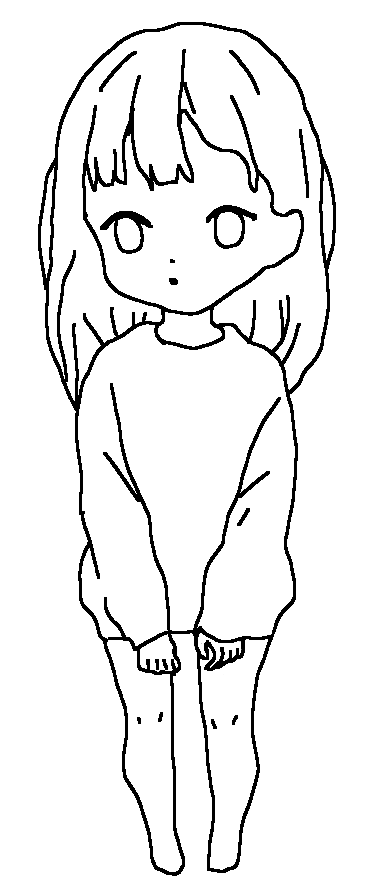
        <p>CHS_01</p>
        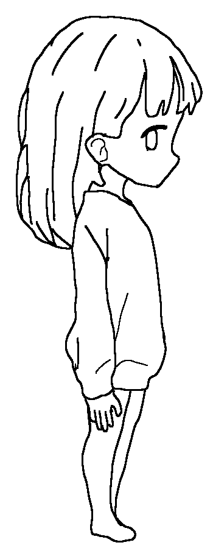
        <p>CHS_02</p>
        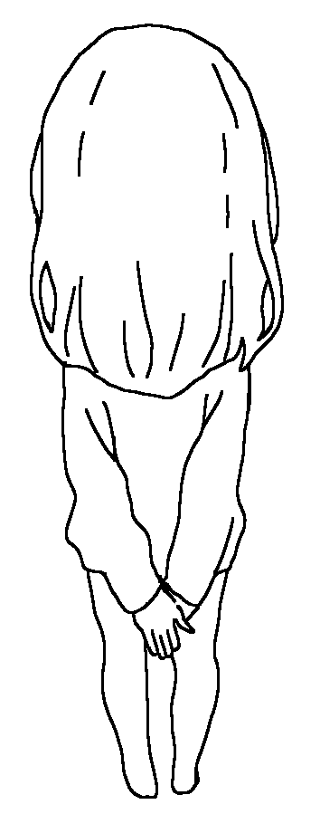
        <p>CHS_03</p>
      </td>
      <td colspan="3" align="center" style="text-align: center; vertical-align: top;">
        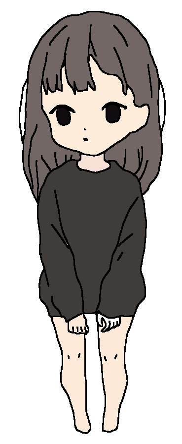
        <p>CHSF_01</p>
        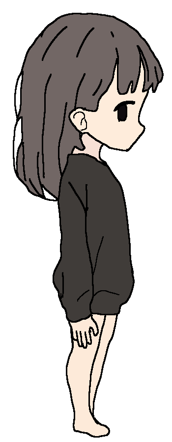
        <p>CHSF_02</p>
        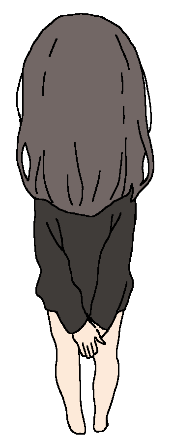
        <p>CHSF_03</p>
      </td>
    </tr>
  </tbody>
</table>

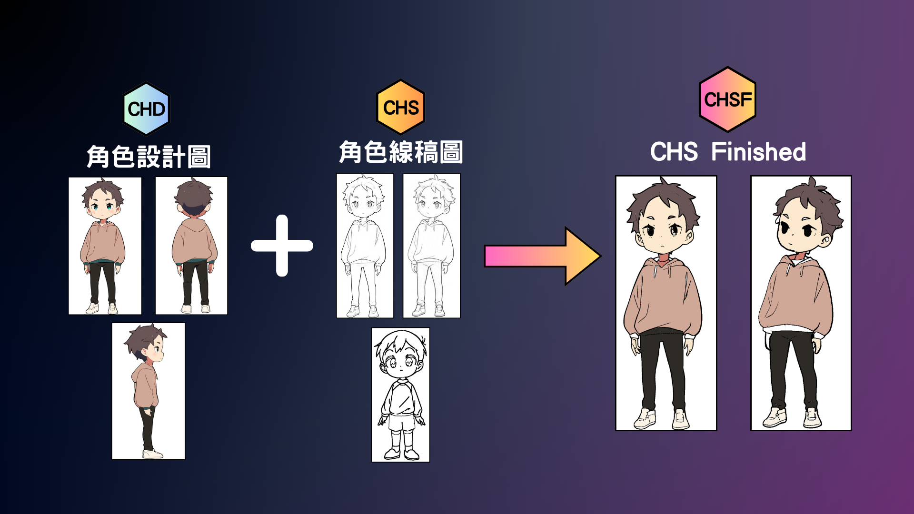
<p align="center">UserIO</p>

- ### Motivation

    For 2D animation, 24 frames per second are usually required for dynamic effects. This highlights the significant labor and time costs involved in base coloring. Discussions with professional animators confirmed our perspective:
    1. Artists: Can you reduce my workload?
    2. Independent artists: It takes forever to color everything alone!
    3. Viewers: Can we get the next season of animation faster?

- ### Core Philosophy

    The core philosophy of Anime Imprimatura revolves around:
    1. AI Collaboration
        Helping with repetitive coloring tasks to encourage collaboration between artists and AI, transforming workflows in the 2D animation industry.
    2. Creativity Encouragement
        Reducing coloring workload lowers the barrier to completing colored animations, inspiring more creative ideas.
    3. Win-Win Outcomes
        Enhancing animation production efficiency and quality allows viewers to enjoy better animations while funding increases for the 2D animation industry. This creates a win-win situation for viewers, animation studios, and artists.

- ### User Journey

    During use, users may have three common questions:
    1. What if I don't have enough multi-angle CHD data?
        If users only have single-angle character designs, we use Hugging Face pipelines to generate multi-angle data for increased training diversity.
    2. What if I don't want to manually categorize CHS for characters?
        We automate the training process, enabling users to train a custom character recognition model by simply uploading CHD.
    3. How to ensure accurate coloring of CHS based on CHD?
        Using Roboflow-trained segmentation models, we recognize and segment basic character components, ensuring accurate CHD-based coloring for CHS.

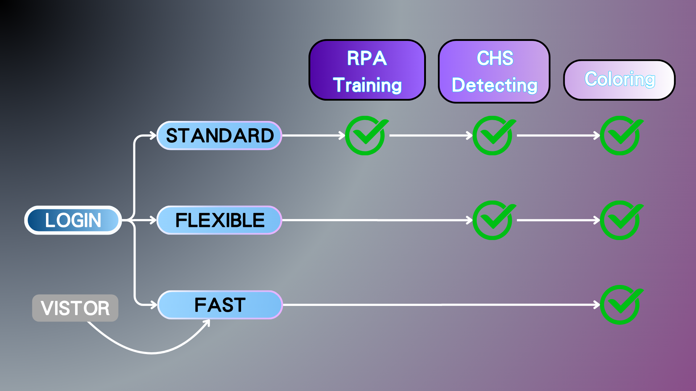
<p align="center">User Module Flowchart</p>

## System Functional Divisions
- ### Multi-Angle Augmentation
    Generate multiple angles and augment the data simultaneously, turning one image into n images.
- ### RPA Training
    Use the augmented data for training datasets to create custom character recognition models.
- ### CHS Recognition
    Identify whether input CHS images belong to the intended character using the custom recognition model.
- ### Component Segmentation
    Train a YOLOv8 segmentation model to identify and segment components like eyes, face, hair, etc.
- ### CHD Color Extraction and CHS Coloring
    Extract colors from CHD and apply them to CHS using color and position dictionaries. The final output is a fully colored CHSF.

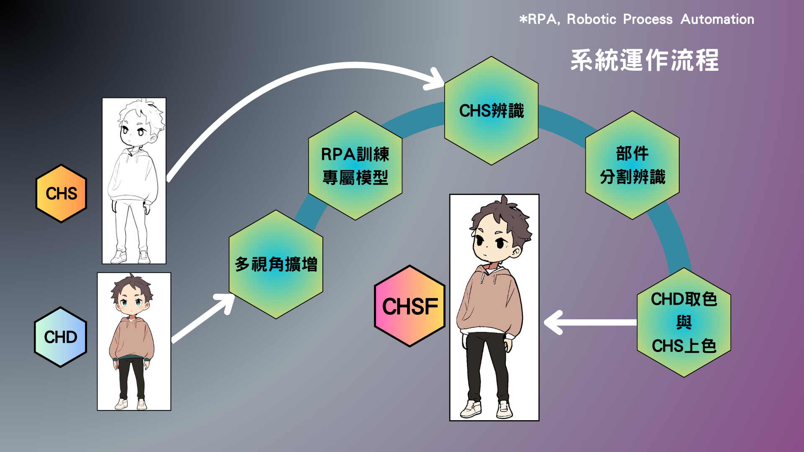
<p align="center">System Workflow Diagram</p>

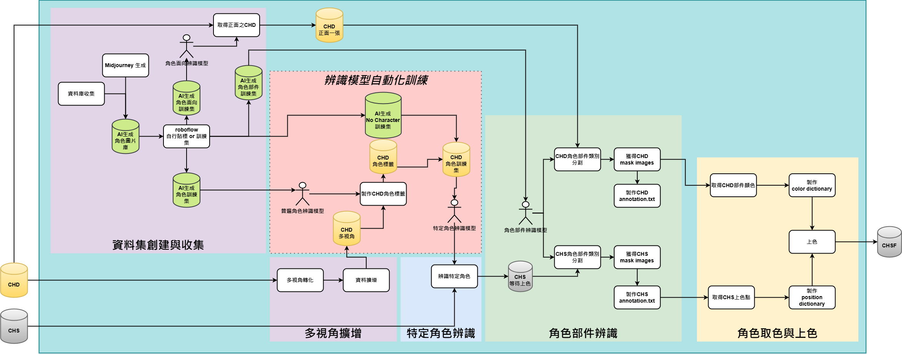
<p align="center">AI Functional Module Diagram</p>

## System Architecture
- ### Frontend
    Provides an intuitive and visually appealing user interface.
    - Tools and Technologies:
        - Design: Figma
        - Template Engine: PUG
        - Styling: CSS
        - Interactivity: JavaScript
- ### Backend
    Manages data flow, business logic, and integration between the frontend and AI.
    - Tools and Technologies:
        - Framework: Express.js
        - Environment Management: dotenv
        - Programming Language: Node.js
- ### AI Functional Modules
    Handles tasks like model training, prediction, and image processing.
    - Frameworks and Libraries:
        - Ultralytics YOLOv8
        - PyTorch
        - OpenCV
        - Hugging Face Transformers
        - Stability AI
        - Python, Flask
- ### System Deployment
    Deployed on Taiwan Computing Cloud (TWCC) using Ubuntu, Docker, MongoDB Atlas, and other tools.

1. Cloud Infrastructure: The system operates on Taiwan's Cypress High Performance Computing Service (TWCC).
2. Operating System: The system is hosted in a Linux environment (Ubuntu).
3. Containerization: Docker modularizes the system by isolating the frontend, backend, and AI components into separate containers.
4. Data Collection and Training: Midjourney and Roboflow are used to prepare images and data for model training.
5. Data Processing: MongoDB Atlas securely stores all persistent data.
6. Frontend: The frontend communicates with the backend through API calls, using PUG templates with CSS and JavaScript to render the user interface.
7. Backend: Express.js and Python are used to manage API endpoints, authentication, and database communication.
8. AI Features: Hosted AI models process images, and libraries like PyTorch and OpenCV are used for coloring and color extraction, with the results returned to the backend.

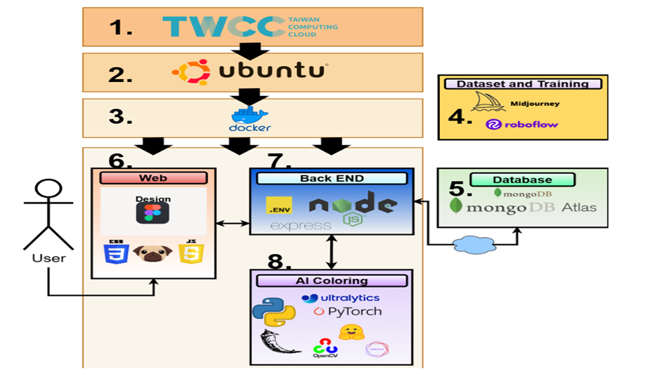
<p align="center">System Architecture Diagram</p>

## System Deployment
1. ### Clone the release branch
    ```bash
    git clone --branch release --single-branch https://github.com/ThanatosJun/Anime-Imprimatura.git
    ```
2. ### Install required environments
    - #### Node.js Environment
    ```bash
    npm install
    ```
    - #### Python Environment
    ```
    pip install -r requirements.txt
    ```
3. ### Configure environment variables
    Edit the `.env` file:
    - #### Update MongoDB Atlas connection
        - Create a MongoDB account (https://cloud.mongodb.com/)
        - Set up an Atlas project and cluster.
3. ### Environment Variable Changes
    Open the `.env` file.
    - #### Update MongoDB Atlas Database Connection
        - Create a MongoDB account ([https://cloud.mongodb.com/](https://cloud.mongodb.com/))
        - Create an Atlas project!  
          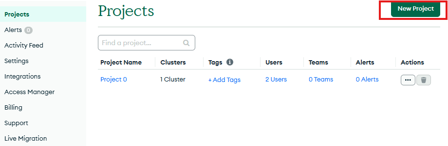
        - Set up a Cluster.  
          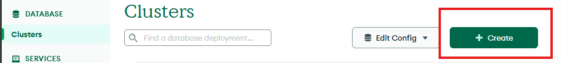
        - Configure Database Access and Network Access.  
          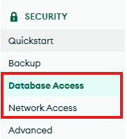
        - Replace the database connection:
            ```env
            MONGO_URI=
            # MONGO_URI=mongodb+srv://<USER_NAME>:<USER_PASSWORD>@<CLUSTER_SEQUENCE>.mongodb.net/?retryWrites=true&w=majority&appName=<PROJECTNAME>
            ```

    - #### Update JWT Authentication Key
        - Set it to any secure random string.
        ```env
        JWT_SECRET=
        # JWT_SECRET=somerandomstringthatissecureandlongenough
        ```

4. ### Start the Node.js Server
```javascript
node app.js
```
5. ### Start Flask Server
```Python
python AI_Function/test.py
```
6. ### Trun on webside and use this system
turn on with brower http://localhost:3000/

## Development and Research Extensions

1. ### Multi-Angle Augmentation

    The zero123 model used in this project performs poorly in generating multi-angle perspectives for 2D animation characters, significantly affecting the performance of the custom recognition model trained on the data. Adobe's Project Turntable could potentially address this limitation by generating diverse perspectives to compensate for the lack of training data.

2. ### Replacement of Component Segmentation and Recognition Model

    The project initially tested Meta's SAM model, which excels at identifying fine-grained enclosed regions. However, it struggles to distinguish which segment belongs to which body part. Additionally, SAM requires higher computational power compared to the custom segmentation model trained using Roboflow. Consequently, a custom-trained segmentation model was adopted. This model is limited in its ability to segment intricate parts and fine-grained enclosed regions, and it struggles with images in different art styles, recognizing only the 15 basic components:
    **Component Categories:**  
    Arm, Ear, Eye, Eyebrow, Face, Foot, Hair, Hand, Leg, Lower_clothes, Neck, Open_mouth, Shoe, Stock, Upper_clothes.

3. ### Optimization of Color Extraction and Filling Process

    The current method uses masks to extract colors, forming a `class dictionary [class, color]` and a `position dictionary [class, position]`. Flood-fill is then applied for coloring. While this approach accurately retrieves the average color for a mask when its position is correct, it cannot handle gradient colors and is therefore limited to flat coloring. For successful coloring, line segments must be closed; otherwise, color overflow is likely to occur.

---

## Branch Descriptions

- ### [main](https://github.com/ThanatosJun/Anime-Imprimatura/tree/main)
  Contains scattered functions and an overall project introduction.

- ### [release](https://github.com/ThanatosJun/Anime-Imprimatura/tree/release)
  A fully organized and deployable local system.

---

## Contributions

This project is licensed under the MIT License. See the [LICENSE](./LICENSE) file for details.

### Contributors
- [ThanatosJun](https://github.com/ThanatosJun)
- [TiasheKnight](https://github.com/TiasheKnight)
- [pizzaInmystomach](https://github.com/pizzaInmystomach)
- [ying0607](https://github.com/ying0607)
- [lemonade33456](https://github.com/lemonade33456)
- [CPW0919](https://github.com/CPW0919)
